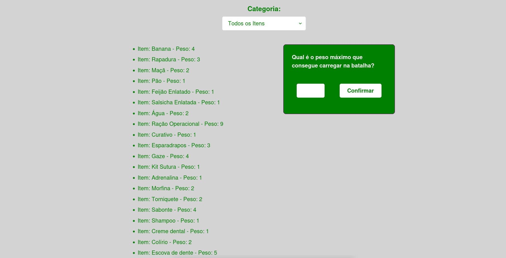
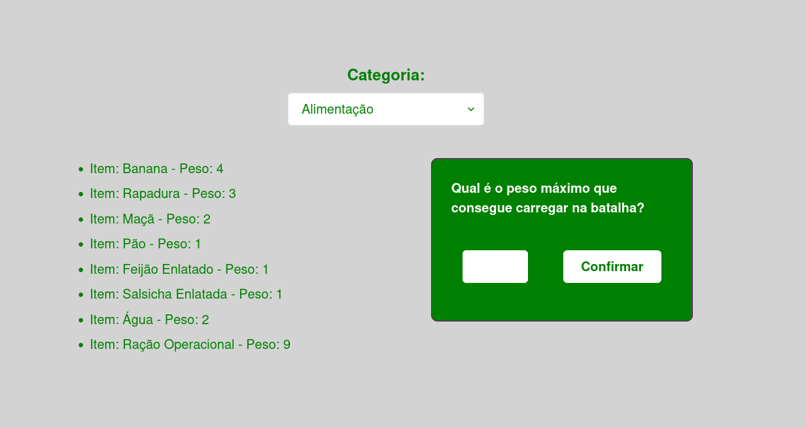
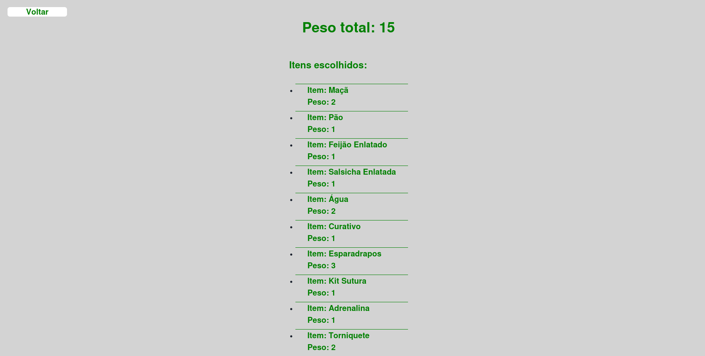

# Soldier Bag

**Número da Lista**: 32 
**Conteúdo da Disciplina**: D&C 

## Alunos
|Matrícula | Aluno |
| -- | -- |
| 18/0149687 |  Daniel Porto de Souza |

## Sobre 
Um soldado, quando convocado à batalha, está responsável por montar e manter a sua mochil de utilitários. Dessa forma, a plataforma utiliza o algorítimo knapsack 0-1 para ajudar nessa montagem conforme a capacidade da machila do soldado.

## Screenshots

## Instalação 
**Linguagem**: JavaScript 
### Pré-requisitos:
- Git
- npm

## Uso 
Para a utilização, basta clonar o repositório com:
> $ git clone https://github.com/projeto-de-algoritmos/DP_Soldier_Bag.git

Feito a clone, dentro do diretório do repositório, basta executar os comandos:

> $ npm install

> $ npm start

Uma aba no seu navegador padrão deverá abrir. Casos não abra, basta acessar o localhost:3000

## Uso 
Para utilizar basta filtrar os itens conforme a sua categoria, digitar o peso máximo e clicar em confirmar.

